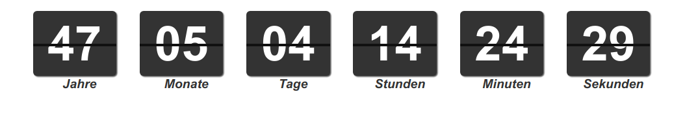

[](https://travis-ci.org/Granze/flip-countdown)

# &lt;flip-countdown&gt;

A flip countdown made with [Polymer](http://polymer-project.org) and [Moment.js](https://github.com/moment/momentjs.com)

## Screenshot 



## Installation

Install using [Bower](http://bower.io):

```shell
 bower install github.com/itnode/flip-countdown
```

##test

Install [web-component-tester](https://github.com/Polymer/web-component-tester) globally

```shell
 npm install -g web-component-tester
```

cd in the flip-countdown folder and run ```wct```. That's it!

## License

[MIT License](http://opensource.org/licenses/MIT)
